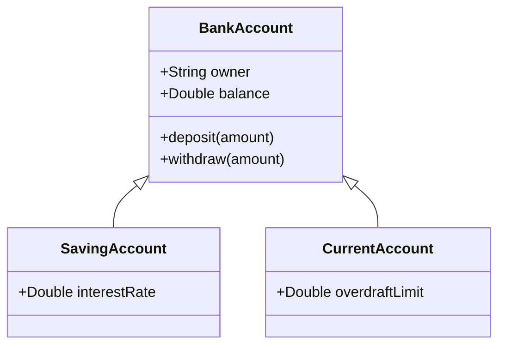

# Class Diagram

```mermaid
classDiagram
    BankAccount <|-- SavingAccount
    BankAccount <|-- CurrentAccount
    BankAccount : +String owner
    BankAccount : +Double balance
    BankAccount : +deposit(amount)
    BankAccount : +withdraw(amount)
    
    class SavingAccount{
      +Double interestRate
    }
    class CurrentAccount{
      +Double overdraftLimit
    }
```
