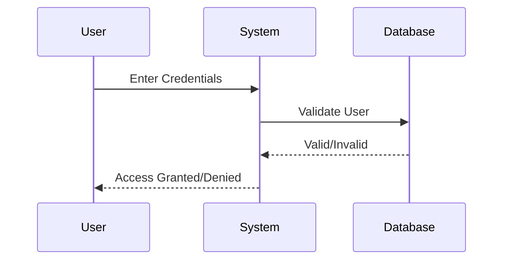

# Sequence Diagram

```mermaid
sequenceDiagram
    participant U as User
    participant S as System
    participant D as Database
    
    U->>S: Enter Credentials
    S->>D: Validate User
    D-->>S: Valid/Invalid
    S-->>U: Access Granted/Denied
```
