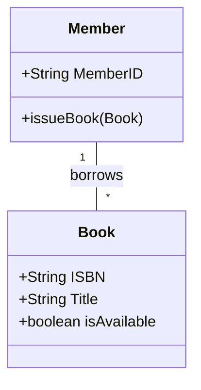

# Class Diagram

```mermaid
classDiagram
    class Book {
        +String ISBN
        +String Title
        +boolean isAvailable
    }
    class Member {
        +String MemberID
        +issueBook(Book)
    }
    Member "1" -- "*" Book : borrows
```
