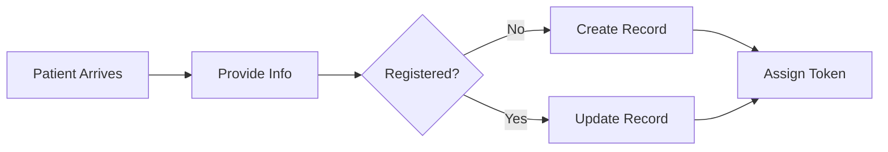

# Functional Requirements

1. **FR-01**: The system shall allow receptionists to register patients.
2. **FR-02**: The system shall generate unique Patient IDs.
3. **FR-03**: Doctors shall be able to view patient history.

## Activity Diagram (Registration)

